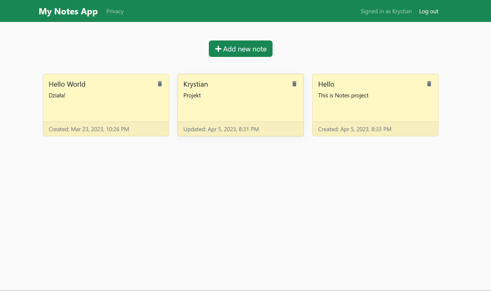

<br />
<div align="center">
  <h1 style="margin-bottom: 50px">My Notes App </h1>
 
</div>


# Table of Contents

- [About The Project](#about-the-project)
- [Video How App Work
  ](#video-how-app-work)
- [Built With
  ](#built-with
  )
- [Getting Started
  ](#getting-started)
- [Roadmap](#roadmap)
- [Contact](#contact)


## About The Project

My Notes App is my first big project and important for me. In the project I used the acquired knowledge and put it together in this project.

Using My Notes App, we can easily add and quickly edit/delete our notes.

We set up our own account so that our notes are always available to us.

The application is fully responsive so we can use it on a phone or laptop.


## Video How App Work


https://user-images.githubusercontent.com/94081707/230200234-e0d291d3-a46f-4e09-89d4-59cb42b52273.mp4


## Built With

<p align="center">
  <a href="https://skillicons.dev">
    
  </a>
</p>


## Getting Started

To run this project, install it locally using npm.

### Prerequisites

Install the latest version of npm in your runtime.
* npm
  ```sh
  npm install npm@latest -g
  ```

### Installation


1. Clone the repo
   ```sh
   git clone https://github.com/krystian2077/notes-app-backend.git
   ```
3. Install NPM packages
   ```sh
   npm install
   ```
4. Run npm script
   ```sh
   npm start nodemon src/server.ts
   ```


## Roadmap

- [x] Add responsive view
- [x] Add authentication
- [ ] Add dark/light mode
- [ ] Add search field for notes


<!-- CONTACT -->
## Contact

Email: krystian.potaczek07@gmail.com

My phone number: 788-986-074


